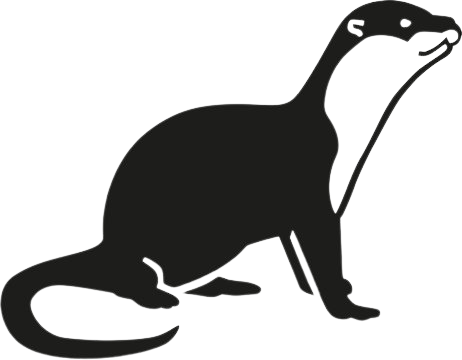

## The Otter Programming Language
**Otter** is a statically-typed programming language that *tries* to be simple and fast. It can compile to multiple targets like how [**Haxe**](https://en.wikipedia.org/wiki/Haxe) does, the targets being:

* [**JavaScript**](https://en.wikipedia.org/wiki/JavaScript)
* [**C**](https://en.wikipedia.org/wiki/C_(programming_language))

## Table of Contents  
* [**Overview**](#overview)
* [**Installing from Source**](#installing-from-source)
* [**Building**](#building)
* [**Getting Help**](#getting-help)
* [**Contributing**](#contributing)
* [**License**](#license)

## Overview

This repository is structured into the following directories.

| Directory                  | Description                                                        |
|----------------------------|--------------------------------------------------------------------|
| [**docs**](./docs)         | Language specifiction, standard library documentation, etc.        |
| [**examples**](./examples) | Various code examples.                                             |
| [**images**](./images)     | Images that are used here.                                         |
| [**source**](./source)     | Source code of the compiler.                                       |
| [**tests**](./tests)       | Testing the compiler.                                              |

## Installing from Source
TODO

## Building
TODO

## Getting Help
TODO

## Contributing
TODO

## License
**Otter** is distributed under the [**zlib License**](https://en.wikipedia.org/wiki/Zlib_License#:~:text=The%20zlib%20license%20is%20a,interchangeably%20as%20zlib%2Flibpng%20license.). See [**LICENSE**](./LICENSE) for details.